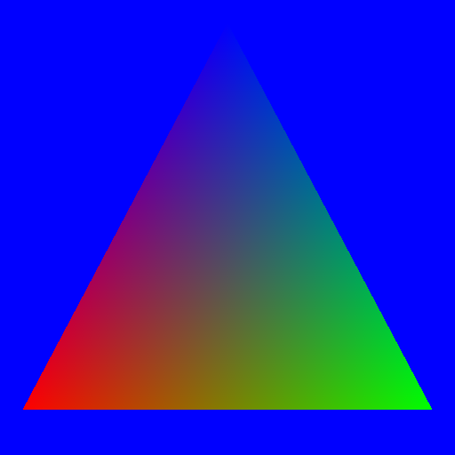

# schmetal

Write Metal shaders in Swift syntax. `swiftc` type-checks them, then schmetal translates
them to `.metal` and compiles a `.metallib`.

A silly proof of concept, held together with tape. Do not ship it. See [Status](#status).

## Example

```swift
import MetalStdlib

struct Uniforms {
    var lightDirection: Float3
    var lightColor: Float3
    var ambient: Float
    var shininess: Float
}

struct Vertex {
    var position: Float4
    var normal: Float3
    var tint: Float3
}

struct Fragment {
    @position var position: Float4
    var normal: Float3
    var tint: Float3
    @flat var materialID: UInt32
}

func saturate(value: Float) -> Float {
    return clamp(value, 0.0, 1.0)
}

@vertex
func litVertex(@buffer(0) vertices: Buffer<Vertex>, vertexID: VertexIndex) -> Fragment {
    let source: Vertex = vertices[vertexID]
    var out: Fragment
    out.position = source.position
    out.normal = source.normal
    out.tint = source.tint
    out.materialID = 0
    return out
}

@fragment
func litFragment(input: Fragment, @buffer(0) uniforms: Uniforms) -> Float4 {
    let diffuse: Float = saturate(value: dot(input.normal, uniforms.lightDirection))
    let specular: Float = pow(diffuse, uniforms.shininess)
    let intensity: Float = saturate(value: uniforms.ambient + diffuse + specular)
    let lit: Float3 = Float3(
        input.tint.x * uniforms.lightColor.x * intensity,
        input.tint.y * uniforms.lightColor.y * intensity,
        input.tint.z * uniforms.lightColor.z * intensity
    )
    return Float4(lit.x, lit.y, lit.z, 1.0)
}
```

```fish
xcb run -- build Examples/lighting.schmetal
```

which generates this Metal Shading Language (.metal) code:

```c
#include <metal_stdlib>
using namespace metal;

struct schmetal_type_0 {
    float3 lightDirection;
    float3 lightColor;
    float ambient;
    float shininess;
};

struct schmetal_type_1 {
    float4 position;
    float3 normal;
    float3 tint;
};

struct schmetal_type_2 {
    float4 position [[position]];
    float3 normal;
    float3 tint;
    uint materialID [[flat]];
};

static float schmetal_helper_0(float value);

static float schmetal_helper_0(float value) {
    return clamp(value, 0.0, 1.0);
}

vertex schmetal_type_2 litVertex(
    device schmetal_type_1 *vertices [[buffer(0)]],
    uint vertexID [[vertex_id]]
) {
    schmetal_type_1 source = vertices[vertexID];
    schmetal_type_2 out;
    out.position = source.position;
    out.normal = source.normal;
    out.tint = source.tint;
    out.materialID = 0;
    return out;
}

fragment float4 litFragment(
    schmetal_type_2 input [[stage_in]],
    constant schmetal_type_0 &uniforms [[buffer(0)]]
) {
    float diffuse = schmetal_helper_0(dot(input.normal, uniforms.lightDirection));
    float specular = pow(diffuse, uniforms.shininess);
    float intensity = schmetal_helper_0(((uniforms.ambient + diffuse) + specular));
    float3 lit = float3(
        ((input.tint.x * uniforms.lightColor.x) * intensity),
        ((input.tint.y * uniforms.lightColor.y) * intensity),
        ((input.tint.z * uniforms.lightColor.z) * intensity)
    );
    return float4(lit.x, lit.y, lit.z, 1.0);
}
```

Rendered with three vertex tints and a light pointing at the triangle:



- `@vertex` and `@fragment` mark entry points. They become `vertex` and `fragment`
  qualifiers in Metal. A function with no marker is a helper, and gets an internal name.
- `@buffer(0)` picks an explicit buffer slot. `Buffer<T>` becomes a writable
  `device T*`, and a plain struct becomes a read-only `constant T&`.
- `Fragment` is a stage-in struct. `@position` and `@flat` become the matching MSL member
  attributes, and the unmarked members interpolate.
- `VertexIndex` carries `[[vertex_id]]`. It is a type rather than an attribute, which is a
  design wart.
- `saturate` and `dot` resolve through real Swift overload resolution, against a prelude
  generated from the supported vocabulary. Structs and helpers get internal names
  (`schmetal_type_0`, `schmetal_helper_0`) so shadowing and overloads survive lowering.
- Every float needs an explicit `Float` annotation, because a bare literal infers `Double`.

## Status

This is a silly proof of concept. 

The language covers a small subset of MSL. Known gaps and lies are in
[ISSUES.md](ISSUES.md). The list of issues is far from exhaustive.

Write real `.metal` files for work you care about.
